# ERD — Sistem Informasi SD Negeri Warialau
**Framework:** Laravel 12 + Filament v3 | **Database:** SQLite
**Dibuat oleh:** Bredcly Fransiscus Tuhuleruw (12155201220021) — UKIM Ambon, 2026

---

## Diagram ERD (Mermaid)

```mermaid
erDiagram

    %% ─── CORE ────────────────────────────────────────────────
    users {
        bigint      id              PK
        string      name
        string      email           UK
        timestamp   email_verified_at
        string      password
        string      role            "admin | orangtua"
        string      no_hp
        string      remember_token
        timestamps  created_at
        timestamps  updated_at
    }

    %% ─── INFORMASI SEKOLAH ───────────────────────────────────
    profil_sekolah {
        bigint  id              PK
        string  nama_sekolah
        string  kepala_sekolah
        string  akreditasi      "A | B | C"
        string  tahun_berdiri
        int     jumlah_ruang_kelas
        text    visi
        text    misi
        text    sejarah
        text    alamat
        string  kontak
        string  logo
        string  koordinat       "lat,lng"
        timestamps created_at
        timestamps updated_at
    }

    settings {
        bigint  id      PK
        string  key     UK
        text    value
        string  type    "text | image | url"
        timestamps created_at
        timestamps updated_at
    }

    %% ─── KONTEN ──────────────────────────────────────────────
    berita {
        bigint  id              PK
        bigint  user_id         FK
        string  judul
        longtext isi
        string  gambar
        string  kategori
        date    tanggal_publish
        string  status          "draft | publish"
        timestamp deleted_at
        timestamps created_at
        timestamps updated_at
    }

    galeri {
        bigint  id          PK
        bigint  user_id     FK
        string  judul
        string  foto
        text    keterangan
        timestamp deleted_at
        timestamps created_at
        timestamps updated_at
    }

    banner {
        bigint  id      PK
        string  judul
        string  gambar
        int     urutan
        string  status  "aktif | nonaktif"
        timestamps created_at
        timestamps updated_at
    }

    %% ─── SDM SEKOLAH ─────────────────────────────────────────
    guru {
        bigint  id              PK
        string  nama
        string  nip
        string  jabatan
        string  mata_pelajaran
        string  no_hp
        string  foto
        string  status          "aktif | nonaktif"
        timestamp deleted_at
        timestamps created_at
        timestamps updated_at
    }

    siswa {
        bigint  id          PK
        string  nama
        string  nis
        string  kelas
        string  jenis_kelamin  "L | P"
        string  tahun_ajaran
        string  foto
        string  status          "aktif | nonaktif | lulus"
        timestamp deleted_at
        timestamps created_at
        timestamps updated_at
    }

    %% ─── PENDAFTARAN ─────────────────────────────────────────
    info_pendaftaran {
        bigint  id              PK
        bigint  user_id         FK
        string  tahun_ajaran
        date    tanggal_buka
        date    tanggal_tutup
        int     kuota
        text    syarat
        string  status          "aktif | nonaktif"
        timestamps created_at
        timestamps updated_at
    }

    pendaftaran {
        bigint  id                      PK
        bigint  user_id                 FK
        bigint  info_pendaftaran_id     FK
        string  nama_anak
        string  tempat_lahir
        date    tanggal_lahir
        string  jenis_kelamin           "L | P"
        string  agama
        int     anak_ke
        string  asal_sekolah
        string  nik
        string  no_kk
        text    alamat
        string  nama_ayah
        string  pekerjaan_ayah
        string  nama_ibu
        string  pekerjaan_ibu
        string  nama_wali
        string  no_hp
        string  dokumen
        string  status                  "pending | diterima | ditolak"
        timestamps created_at
        timestamps updated_at
    }

    %% ─── NOTIFIKASI & OTP ────────────────────────────────────
    notifikasi {
        bigint  id              PK
        bigint  user_id         FK
        string  judul
        text    pesan
        string  tipe            "berita | pendaftaran"
        bigint  referensi_id    "id berita atau pendaftaran"
        boolean dibaca
        timestamps created_at
        timestamps updated_at
    }

    otp_codes {
        bigint      id          PK
        string      email
        string      otp         "6 digit"
        timestamp   expires_at
        boolean     used
        timestamps  created_at
        timestamps  updated_at
    }

    %% ─── APLIKASI MOBILE ─────────────────────────────────────
    aplikasi {
        bigint  id              PK
        string  nama_aplikasi
        string  versi
        text    deskripsi
        string  link_download
        string  ukuran_file
        string  status          "aktif | nonaktif"
        timestamps created_at
        timestamps updated_at
    }

    %% ─── SISTEM (Laravel / Spatie / Sanctum) ─────────────────
    media {
        bigint  id                  PK
        string  model_type          "morph"
        bigint  model_id            "morph"
        uuid    uuid                UK
        string  collection_name
        string  name
        string  file_name
        string  mime_type
        string  disk
        string  conversions_disk
        bigint  size
        json    manipulations
        json    custom_properties
        json    generated_conversions
        json    responsive_images
        int     order_column
        timestamps created_at
        timestamps updated_at
    }

    personal_access_tokens {
        bigint      id              PK
        string      tokenable_type  "morph"
        bigint      tokenable_id    "morph"
        text        name
        string      token           UK
        text        abilities
        timestamp   last_used_at
        timestamp   expires_at
        timestamps  created_at
        timestamps  updated_at
    }

    password_reset_tokens {
        string      email   PK
        string      token
        timestamp   created_at
    }

    sessions {
        string  id              PK
        bigint  user_id
        string  ip_address
        text    user_agent
        longtext payload
        int     last_activity
    }

    cache {
        string  key         PK
        mediumtext value
        int     expiration
    }

    %% ─── RELASI ──────────────────────────────────────────────

    users ||--o{ berita              : "menulis (user_id)"
    users ||--o{ galeri              : "mengunggah (user_id)"
    users ||--o{ info_pendaftaran    : "membuat (user_id)"
    users ||--o{ pendaftaran         : "mendaftar (user_id)"
    users ||--o{ notifikasi          : "menerima (user_id)"

    info_pendaftaran ||--o{ pendaftaran : "memiliki (info_pendaftaran_id)"

    guru    ||--o{ media : "foto/dokumen (morph)"
    siswa   ||--o{ media : "foto/dokumen (morph)"
    galeri  ||--o{ media : "foto (morph)"
    pendaftaran ||--o{ media : "dokumen (morph)"

    users ||--o{ personal_access_tokens : "Sanctum token (morph)"
```



---

## Ringkasan Relasi (UML Notation)

```
users (1) ──────────────── (N) berita
users (1) ──────────────── (N) galeri
users (1) ──────────────── (N) info_pendaftaran
users (1) ──────────────── (N) pendaftaran
users (1) ──────────────── (N) notifikasi
users (1) ──────────────── (N) personal_access_tokens  [Sanctum]

info_pendaftaran (1) ───── (N) pendaftaran

guru        (1) ─────────── (N) media   [Spatie - polymorphic]
siswa       (1) ─────────── (N) media   [Spatie - polymorphic]
galeri      (1) ─────────── (N) media   [Spatie - polymorphic]
pendaftaran (1) ─────────── (N) media   [Spatie - polymorphic]
```

---

## Pengelompokan Tabel

### Grup A — Entitas Utama (Domain)
| Tabel | Deskripsi | Relasi ke |
|---|---|---|
| `users` | Akun admin & orang tua | berita, galeri, info_pendaftaran, pendaftaran, notifikasi |
| `profil_sekolah` | Data tunggal profil sekolah | — (standalone) |
| `guru` | Data guru/pegawai | media (morph) |
| `siswa` | Data peserta didik | media (morph) |

### Grup B — Konten Publik
| Tabel | Deskripsi | Relasi ke |
|---|---|---|
| `berita` | Artikel / pengumuman | users (FK) |
| `galeri` | Album foto sekolah | users (FK), media (morph) |
| `banner` | Slider halaman utama | — (standalone) |
| `aplikasi` | Info unduhan APK Flutter | — (standalone) |

### Grup C — Alur Pendaftaran
| Tabel | Deskripsi | Relasi ke |
|---|---|---|
| `info_pendaftaran` | Periode & kuota PPDB | users (FK), pendaftaran |
| `pendaftaran` | Formulir pendaftaran siswa baru | users (FK), info_pendaftaran (FK), media (morph) |

### Grup D — Konfigurasi & Notifikasi
| Tabel | Deskripsi | Relasi ke |
|---|---|---|
| `settings` | Konfigurasi tampilan web | — (key-value store) |
| `notifikasi` | Push notification ke orang tua | users (FK) |
| `otp_codes` | Kode OTP untuk login Flutter | — (by email) |

### Grup E — Sistem & Library
| Tabel | Deskripsi |
|---|---|
| `media` | File upload via Spatie Media Library (polymorphic) |
| `personal_access_tokens` | Token API via Laravel Sanctum (polymorphic) |
| `password_reset_tokens` | Reset password Laravel |
| `sessions` | Sesi login web |
| `cache` | Cache Laravel |
| `jobs` | Queue jobs Laravel |

---

## Keterangan Tipe Data Penting

| Kolom | Nilai yang Diizinkan |
|---|---|
| `users.role` | `admin` \| `orangtua` |
| `guru.status` | `aktif` \| `nonaktif` |
| `siswa.status` | `aktif` \| `nonaktif` \| `lulus` |
| `berita.status` | `draft` \| `publish` |
| `info_pendaftaran.status` | `aktif` \| `nonaktif` |
| `pendaftaran.status` | `pending` \| `diterima` \| `ditolak` |
| `banner.status` | `aktif` \| `nonaktif` |
| `aplikasi.status` | `aktif` \| `nonaktif` |
| `settings.type` | `text` \| `image` \| `url` |
| `notifikasi.tipe` | `berita` \| `pendaftaran` |
| `profil_sekolah.akreditasi` | `A` \| `B` \| `C` |
| `pendaftaran.jenis_kelamin` | `L` \| `P` |
| `siswa.jenis_kelamin` | `L` \| `P` |

---

## Soft Delete

Tabel berikut menggunakan `SoftDeletes` (kolom `deleted_at`):
- `guru`
- `siswa`
- `berita`
- `galeri`

---

## Prompt untuk dbdiagram.io

Salin teks di bawah ke [dbdiagram.io](https://dbdiagram.io) untuk visualisasi interaktif:

```
Table users {
  id bigint [pk, increment]
  name varchar
  email varchar [unique]
  email_verified_at timestamp [null]
  password varchar
  role varchar [note: "admin | orangtua"]
  no_hp varchar [null]
  remember_token varchar [null]
  created_at timestamp
  updated_at timestamp
}

Table profil_sekolah {
  id bigint [pk, increment]
  nama_sekolah varchar
  kepala_sekolah varchar [null]
  akreditasi varchar [null, note: "A | B | C"]
  tahun_berdiri varchar [null]
  jumlah_ruang_kelas int [null]
  visi text [null]
  misi text [null]
  sejarah text [null]
  alamat text [null]
  kontak varchar [null]
  logo varchar [null]
  koordinat varchar [null, note: "lat,lng"]
  created_at timestamp
  updated_at timestamp
}

Table guru {
  id bigint [pk, increment]
  nama varchar
  nip varchar [null]
  jabatan varchar [null]
  mata_pelajaran varchar [null]
  no_hp varchar [null]
  foto varchar [null]
  status varchar [note: "aktif | nonaktif"]
  deleted_at timestamp [null]
  created_at timestamp
  updated_at timestamp
}

Table siswa {
  id bigint [pk, increment]
  nama varchar
  nis varchar [null]
  kelas varchar [null]
  jenis_kelamin varchar [null, note: "L | P"]
  tahun_ajaran varchar [null]
  foto varchar [null]
  status varchar [note: "aktif | nonaktif | lulus"]
  deleted_at timestamp [null]
  created_at timestamp
  updated_at timestamp
}

Table berita {
  id bigint [pk, increment]
  user_id bigint [ref: > users.id]
  judul varchar
  isi longtext
  gambar varchar [null]
  kategori varchar [null]
  tanggal_publish date [null]
  status varchar [note: "draft | publish"]
  deleted_at timestamp [null]
  created_at timestamp
  updated_at timestamp
}

Table galeri {
  id bigint [pk, increment]
  user_id bigint [ref: > users.id]
  judul varchar
  foto varchar
  keterangan text [null]
  deleted_at timestamp [null]
  created_at timestamp
  updated_at timestamp
}

Table banner {
  id bigint [pk, increment]
  judul varchar
  gambar varchar
  urutan int
  status varchar [note: "aktif | nonaktif"]
  created_at timestamp
  updated_at timestamp
}

Table info_pendaftaran {
  id bigint [pk, increment]
  user_id bigint [ref: > users.id]
  tahun_ajaran varchar
  tanggal_buka date
  tanggal_tutup date
  kuota int
  syarat text [null]
  status varchar [note: "aktif | nonaktif"]
  created_at timestamp
  updated_at timestamp
}

Table pendaftaran {
  id bigint [pk, increment]
  user_id bigint [ref: > users.id]
  info_pendaftaran_id bigint [ref: > info_pendaftaran.id]
  nama_anak varchar
  tempat_lahir varchar [null]
  tanggal_lahir date
  jenis_kelamin varchar [note: "L | P"]
  agama varchar
  anak_ke int [null]
  asal_sekolah varchar [null]
  nik varchar [null]
  no_kk varchar [null]
  alamat text
  nama_ayah varchar [null]
  pekerjaan_ayah varchar [null]
  nama_ibu varchar [null]
  pekerjaan_ibu varchar [null]
  nama_wali varchar [null]
  no_hp varchar
  dokumen varchar [null]
  status varchar [note: "pending | diterima | ditolak"]
  created_at timestamp
  updated_at timestamp
}

Table notifikasi {
  id bigint [pk, increment]
  user_id bigint [ref: > users.id]
  judul varchar
  pesan text
  tipe varchar [note: "berita | pendaftaran"]
  referensi_id bigint [null]
  dibaca boolean
  created_at timestamp
  updated_at timestamp
}

Table otp_codes {
  id bigint [pk, increment]
  email varchar
  otp varchar(6)
  expires_at timestamp
  used boolean
  created_at timestamp
  updated_at timestamp
}

Table aplikasi {
  id bigint [pk, increment]
  nama_aplikasi varchar
  versi varchar
  deskripsi text [null]
  link_download varchar
  ukuran_file varchar [null]
  status varchar [note: "aktif | nonaktif"]
  created_at timestamp
  updated_at timestamp
}

Table settings {
  id bigint [pk, increment]
  key varchar [unique]
  value text [null]
  type varchar [note: "text | image | url"]
  created_at timestamp
  updated_at timestamp
}

Table media {
  id bigint [pk, increment]
  model_type varchar [note: "polymorphic"]
  model_id bigint [note: "polymorphic"]
  uuid uuid [null, unique]
  collection_name varchar
  name varchar
  file_name varchar
  mime_type varchar [null]
  disk varchar
  conversions_disk varchar [null]
  size bigint
  manipulations json
  custom_properties json
  generated_conversions json
  responsive_images json
  order_column int [null]
  created_at timestamp
  updated_at timestamp
}

Table personal_access_tokens {
  id bigint [pk, increment]
  tokenable_type varchar [note: "polymorphic"]
  tokenable_id bigint [note: "polymorphic"]
  name text
  token varchar(64) [unique]
  abilities text [null]
  last_used_at timestamp [null]
  expires_at timestamp [null]
  created_at timestamp
  updated_at timestamp
}
```
